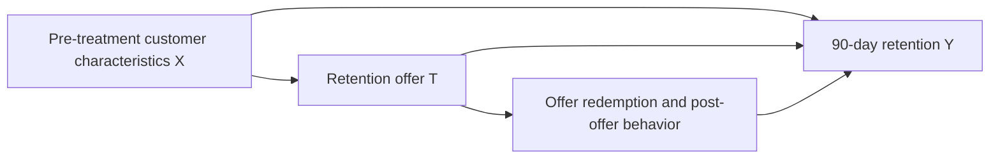

# Causal Design: Personalized Retention Targeting

Subscription businesses often use discounts to reduce customer churn. However,
giving a discount to customers who would renew anyway wastes campaign budget,
while targeting customers who will leave regardless of the offer also produces
little value. The useful target is therefore not simply the customer with the
highest predicted churn risk, but the customer whose probability of retention
would increase because of the discount.

This project implements and evaluates causal machine-learning policies that
select at most 20% of eligible customers for a retention offer. The data are
simulated, so true treatment effects are available for evaluation and are
excluded from model inputs. Stage 5 (S-learner and T-learner evaluation) is
complete; current results and saved artifacts are recorded in Section 14.

## 1. Business decision

Which eligible customers should receive a retention offer to maximize
incremental profit, subject to a campaign-capacity constraint of 20%?

This is an intervention problem rather than a churn-prediction problem. A churn
model estimates who is likely to leave; the proposed causal model estimates who
is likely to stay *because they received the offer*.

## 2. Unit of analysis

The unit of analysis is one active subscription customer at the beginning of a
monthly billing cycle. Each customer appears once in a simulated campaign cohort.

## 3. Eligibility criteria

A customer is eligible if, at the decision time, they:

- have an active paid subscription;
- have completed at least one billing cycle;
- are approaching a renewal date within the next 30 days;
- have not already cancelled;
- have not received another retention promotion within the previous 90 days; and
- have complete pre-treatment history for the required covariates.

These rules define the population to which the estimated effects and resulting
policy apply.

## 4. Treatment

- **Treatment (`T = 1`):** the customer is sent a standardized offer for a $10
  credit toward their next renewal. The offer is valid for seven days and has
  identical wording and delivery channels for all treated customers.
- **Control (`T = 0`):** the customer receives no retention offer during the
  seven-day campaign window.
- **Decision time:** the start of the customer's monthly billing cycle, before
  the offer can be sent and before any outcome is measured.

Defining one standardized offer avoids treating materially different discounts
as if they were the same intervention.

## 5. Outcome

- **Primary outcome (`Y`):** whether the customer remains on a paid subscription
  90 days after the decision time.
- **Measurement window:** day 0 through day 90 after treatment assignment.
- **Encoding:** `Y = 1` if the customer has an active paid subscription on day
  90; otherwise, `Y = 0`.

The binary outcome keeps treatment effects interpretable as percentage-point
changes in retention. Incremental profit is a downstream policy metric rather
than the primary causal outcome.

## 6. Causal questions and estimands

Let `Y(1)` denote a customer's potential 90-day retention outcome if they
receive the offer and `Y(0)` their potential outcome if they do not.

### Conditional average treatment effect

For customers with pre-treatment characteristics `X = x`, how much does the
offer change their probability of remaining subscribed?

$$
\tau(x) = E[Y(1) - Y(0) \mid X = x]
$$

The conditional average treatment effect (CATE) is the primary estimand because
it supports personalized treatment decisions.

### Average treatment effect

Across the eligible customer population, how much would 90-day retention change
if everyone received the offer rather than nobody receiving it?

$$
ATE = E[Y(1) - Y(0)]
$$

The ATE measures average campaign effectiveness, but it is not sufficient for
deciding which 20% of customers to target.

## 7. Decision objective

For the initial simulation, assume:

- value of retaining a customer for 90 days: **$80**;
- cost of treating a customer: **$10**; and
- campaign capacity: at most **20% of eligible customers**.

The predicted incremental value of treating customer `i` is:

$$
\widehat{IV}_i = 80\widehat{\tau}(X_i) - 10
$$

Without a capacity constraint, treatment is worthwhile when
`tau(X_i) > 10/80 = 0.125`. With the 20% constraint, the policy treats up to the
top 20% of customers ranked by positive predicted incremental value. These
financial values are explicit simulation assumptions and will later be varied
in sensitivity analysis.

## 8. Pre-treatment covariates

All model features must be observed before the decision time.

| Variable | Description | Causal role |
|---|---|---|
| `tenure_months` | Completed months as a subscriber | Confounder and possible effect modifier |
| `monthly_price` | Current subscription price | Confounder |
| `login_days_30d` | Number of active days in the previous 30 days | Confounder and effect modifier |
| `usage_trend_90d` | Change in product usage over the previous 90 days | Confounder and effect modifier |
| `support_tickets_30d` | Support tickets opened before treatment | Confounder and effect modifier |
| `late_payments_12m` | Late payments in the previous year | Confounder |
| `plan_type` | Current subscription tier | Confounder and effect modifier |
| `region` | Customer's broad geographic region | Possible confounder |
| `device_type` | Customer's primary access device | Possible effect modifier |

A variable can be both a confounder and an effect modifier. For example, recent
engagement can influence historical offer assignment, baseline retention, and
the customer's response to a discount.

## 9. Causal DAG

The path `X -> T` represents non-random historical targeting: customers showing
churn-risk signals are more likely to receive an offer. The path `X -> Y` makes
those same signals common causes of treatment and retention. The total effect of
`T` on `Y` includes any effect mediated through offer redemption or later usage.

## 10. Adjustment set

The initial adjustment set contains the measured pre-treatment covariates listed
in Section 8:

$$
X = \{\text{tenure, price, engagement, usage trend, support history, payment
history, plan, region, device}\}
$$

They are included to block backdoor paths from treatment to outcome through
pre-treatment customer characteristics. The simulation will initially ensure
that all common causes of treatment and retention are represented in `X`.

## 11. Excluded variables

The following variables occur after treatment and must not be used as adjustment
features:

- whether the offer was opened;
- whether the offer was redeemed;
- post-offer logins or product usage;
- post-offer support contacts;
- post-offer payment behavior; and
- the observed outcome itself.

These variables may mediate the treatment effect. Conditioning on them would
change the estimand or introduce post-treatment bias. The simulator's true
potential outcomes and true individual treatment effects are also excluded from
model training; they are retained only for evaluation.

## 12. Identification assumptions

### Consistency

For each customer, the observed outcome equals the potential outcome under the
treatment they actually receive. The standardized offer and control conditions
must therefore be implemented as defined in Section 4.

### Conditional exchangeability

$$
(Y(1), Y(0)) \perp T \mid X
$$

After conditioning on the measured pre-treatment covariates, treatment assignment
is independent of the potential outcomes. The implemented simulator satisfies this
assumption by construction. A later stress test may introduce an unobserved
confounder to show how violations affect the estimates.

### Positivity

$$
0 < P(T=1 \mid X=x) < 1
$$

Every customer profile in the target population has a non-zero probability of
receiving either treatment condition. The simulator caps extreme treatment
propensities, and the simulation audit checks overlap empirically.

### No interference

One customer's treatment does not affect another customer's retention outcome.
The initial simulation excludes offer sharing, referrals, social influence, and
competition for limited service resources.

## 13. Current decisions and remaining questions

The baseline implementation uses a binary 90-day retention outcome, one record
per customer, and a guaranteed $10 cost per treated customer. Expected
incremental profit is the policy decision metric; regret and the fraction of
oracle profit captured provide comparison with the simulation's upper bound.
The implemented confounding and heterogeneity mechanisms are documented in
[data_generating_process.md](data_generating_process.md).

Remaining work includes:

- sensitivity analysis for retention value, treatment cost, and campaign capacity;
- repeated simulation seeds to quantify uncertainty in model and policy comparisons;
- stress tests for weaker overlap and unobserved confounding;
- deciding whether to add redemption-dependent costs, longitudinal cohorts, or
  continuous revenue outcomes; and
- evaluation methods for real observational data, where oracle effects are unavailable.

## 14. Project status and Stage 5 results

Updated: 2026-10-03. Work is complete through Stage 5 for the baseline simulated
setting. No later-stage implementation is claimed here.

| Component | Current status | Implementation or artifact |
|---|---|---|
| Causal design | Defined and updated with implemented assumptions | This document |
| Customer simulation | Implemented, with observed and oracle columns | `src/simulation.py`, `scripts/generate_data.py` |
| Simulation audit | Notebook and saved diagnostic figures available | `notebooks/01_simulation_audit.ipynb`, `reports/figures/` |
| Stage 4 policy baselines | Implemented, including churn-based targeting and oracle comparisons | `src/policies.py`, `notebooks/02_policy_baseline.ipynb` |
| Stage 5 causal meta-learners | Implemented and rerun successfully; all notebook checks pass | `src/causal_learners.py`, `notebooks/03_causal_meta_learners.ipynb` |
| Stage 5 figure persistence | Fixed: all four PNGs saved within the repository for Git tracking | Figure links below |

Stage 5 recreates the deterministic 70/30 split of 20,000 simulated customers
(seed 42): 14,000 for training and 6,000 for evaluation. S-learner and T-learner
random-forest outcome models use pre-treatment covariates, observed treatment,
and observed retention. Oracle columns are used only for evaluation. Model
policies select positive predicted incremental value subject to the 20% capacity.

The rerun produced these treatment-effect metrics:

| Model | True ATE | Predicted ATE | Absolute ATE error | PEHE (root mean squared CATE error) | CATE MAE | CATE correlation |
|---|---:|---:|---:|---:|---:|---:|
| S-learner | 0.1562 | 0.0918 | 0.0645 | 0.0922 | 0.0707 | 0.7820 |
| T-learner | 0.1562 | 0.0935 | 0.0628 | 0.0979 | 0.0770 | 0.6864 |

Policy results use the assumed $80 retention value and $10 treatment cost:

| Policy | Customers treated | Expected incremental profit | Regret versus oracle | Oracle profit captured |
|---|---:|---:|---:|---:|
| Treat nobody | 0 | $0.00 | $17,556.23 | 0.0% |
| Random 20% | 1,200 | $3,105.94 | $14,450.29 | 17.7% |
| S-learner | 1,200 | $14,130.83 | $3,425.39 | 80.5% |
| T-learner | 1,200 | $12,798.56 | $4,757.67 | 72.9% |
| Oracle 20% | 1,200 | $17,556.23 | $0.00 | 100.0% |

The S-learner has lower PEHE and higher policy profit in this run. Both learners
underestimate the average effect. These are expected results evaluated against
simulation truth, rather than realized campaign profit or evidence of superiority
across populations or random seeds. The oracle is an evaluation upper bound.

### Saved Stage 5 figures

- [True and predicted CATE distributions](../reports/figures/meta_learner_cate_distributions.png)
- [Predicted versus true CATE](../reports/figures/meta_learner_cate_scatter.png)
- [CATE calibration by predicted-effect rank](../reports/figures/meta_learner_cate_calibration.png)
- [Policy incremental-profit comparison](../reports/figures/meta_learner_policy_profit.png)

To reproduce the figures, start Jupyter from the repository or its `notebooks/`
directory and run `03_causal_meta_learners.ipynb` from top to bottom. If the kernel
starts elsewhere, set `CAUSAL_INFERENCE_ROOT` to the repository path before
running the setup cells. Setup validates the repository before creating
`reports/figures/`, and fails explicitly if it cannot find it. This replaces the
previous conflicting root assignments that saved images outside the repository.
