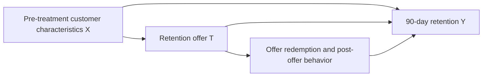

# Causal Design: Personalized Retention Targeting

Subscription businesses often use discounts to reduce customer churn. However,
giving a discount to customers who would renew anyway wastes campaign budget,
while targeting customers who will leave regardless of the offer also produces
little value. The useful target is therefore not simply the customer with the
highest predicted churn risk, but the customer whose probability of retention
would increase because of the discount.

This project implements and evaluates causal machine-learning policies that
select at most 20% of eligible customers for a retention offer. The data are
simulated, so true treatment effects are available for evaluation and are
excluded from model inputs. The project is complete through Stage 8: S/T
meta-learners, doubly robust learning, observational policy evaluation,
repeated-seed/business-assumption robustness, and causal stress tests. Stage 5
results are in Section 14, Stage 6 in Section 15, Stage 7 in Section 16, and
current Stage 8 results in Section 17.

## 1. Business decision

Which eligible customers should receive a retention offer to maximize
incremental profit, subject to a campaign-capacity constraint of 20%?

This is an intervention problem rather than a churn-prediction problem. A churn
model estimates who is likely to leave; the proposed causal model estimates who
is likely to stay *because they received the offer*.

## 2. Unit of analysis

The unit of analysis is one active subscription customer at the beginning of a
monthly billing cycle. Each customer appears once in a simulated campaign cohort.

## 3. Eligibility criteria

A customer is eligible if, at the decision time, they:

- have an active paid subscription;
- have completed at least one billing cycle;
- are approaching a renewal date within the next 30 days;
- have not already cancelled;
- have not received another retention promotion within the previous 90 days; and
- have complete pre-treatment history for the required covariates.

These rules define the population to which the estimated effects and resulting
policy apply.

## 4. Treatment

- **Treatment (`T = 1`):** the customer is sent a standardized offer for a $10
  credit toward their next renewal. The offer is valid for seven days and has
  identical wording and delivery channels for all treated customers.
- **Control (`T = 0`):** the customer receives no retention offer during the
  seven-day campaign window.
- **Decision time:** the start of the customer's monthly billing cycle, before
  the offer can be sent and before any outcome is measured.

Defining one standardized offer avoids treating materially different discounts
as if they were the same intervention.

## 5. Outcome

- **Primary outcome (`Y`):** whether the customer remains on a paid subscription
  90 days after the decision time.
- **Measurement window:** day 0 through day 90 after treatment assignment.
- **Encoding:** `Y = 1` if the customer has an active paid subscription on day
  90; otherwise, `Y = 0`.

The binary outcome keeps treatment effects interpretable as percentage-point
changes in retention. Incremental profit is a downstream policy metric rather
than the primary causal outcome.

## 6. Causal questions and estimands

Let `Y(1)` denote a customer's potential 90-day retention outcome if they
receive the offer and `Y(0)` their potential outcome if they do not.

### Conditional average treatment effect

For customers with pre-treatment characteristics `X = x`, how much does the
offer change their probability of remaining subscribed?

$$
\tau(x) = E[Y(1) - Y(0) \mid X = x]
$$

The conditional average treatment effect (CATE) is the primary estimand because
it supports personalized treatment decisions.

### Average treatment effect

Across the eligible customer population, how much would 90-day retention change
if everyone received the offer rather than nobody receiving it?

$$
ATE = E[Y(1) - Y(0)]
$$

The ATE measures average campaign effectiveness, but it is not sufficient for
deciding which 20% of customers to target.

## 7. Decision objective

For the initial simulation, assume:

- value of retaining a customer for 90 days: **$80**;
- cost of treating a customer: **$10**; and
- campaign capacity: at most **20% of eligible customers**.

The predicted incremental value of treating customer `i` is:

$$
\widehat{IV}_i = 80\widehat{\tau}(X_i) - 10
$$

Without a capacity constraint, treatment is worthwhile when
`tau(X_i) > 10/80 = 0.125`. With the 20% constraint, the policy treats up to the
top 20% of customers ranked by positive predicted incremental value. These
financial values are explicit simulation assumptions and will later be varied
in sensitivity analysis.

## 8. Pre-treatment covariates

All model features must be observed before the decision time.

| Variable | Description | Causal role |
|---|---|---|
| `tenure_months` | Completed months as a subscriber | Confounder and possible effect modifier |
| `monthly_price` | Current subscription price | Confounder |
| `login_days_30d` | Number of active days in the previous 30 days | Confounder and effect modifier |
| `usage_trend_90d` | Change in product usage over the previous 90 days | Confounder and effect modifier |
| `support_tickets_30d` | Support tickets opened before treatment | Confounder and effect modifier |
| `late_payments_12m` | Late payments in the previous year | Confounder |
| `plan_type` | Current subscription tier | Confounder and effect modifier |
| `region` | Customer's broad geographic region | Possible confounder |
| `device_type` | Customer's primary access device | Possible effect modifier |

A variable can be both a confounder and an effect modifier. For example, recent
engagement can influence historical offer assignment, baseline retention, and
the customer's response to a discount.

## 9. Causal DAG

The path `X -> T` represents non-random historical targeting: customers showing
churn-risk signals are more likely to receive an offer. The path `X -> Y` makes
those same signals common causes of treatment and retention. The total effect of
`T` on `Y` includes any effect mediated through offer redemption or later usage.

## 10. Adjustment set

The initial adjustment set contains the measured pre-treatment covariates listed
in Section 8:

$$
X = \{\text{tenure, price, engagement, usage trend, support history, payment
history, plan, region, device}\}
$$

They are included to block backdoor paths from treatment to outcome through
pre-treatment customer characteristics. The simulation will initially ensure
that all common causes of treatment and retention are represented in `X`.

## 11. Excluded variables

The following variables occur after treatment and must not be used as adjustment
features:

- whether the offer was opened;
- whether the offer was redeemed;
- post-offer logins or product usage;
- post-offer support contacts;
- post-offer payment behavior; and
- the observed outcome itself.

These variables may mediate the treatment effect. Conditioning on them would
change the estimand or introduce post-treatment bias. The simulator's true
potential outcomes and true individual treatment effects are also excluded from
model training; they are retained only for evaluation.

## 12. Identification assumptions

### Consistency

For each customer, the observed outcome equals the potential outcome under the
treatment they actually receive. The standardized offer and control conditions
must therefore be implemented as defined in Section 4.

### Conditional exchangeability

$$
(Y(1), Y(0)) \perp T \mid X
$$

After conditioning on the measured pre-treatment covariates, treatment assignment
is independent of the potential outcomes. The implemented simulator satisfies this
assumption by construction. A later stress test may introduce an unobserved
confounder to show how violations affect the estimates.

### Positivity

$$
0 < P(T=1 \mid X=x) < 1
$$

Every customer profile in the target population has a non-zero probability of
receiving either treatment condition. The simulator caps extreme treatment
propensities, and the simulation audit checks overlap empirically.

### No interference

One customer's treatment does not affect another customer's retention outcome.
The initial simulation excludes offer sharing, referrals, social influence, and
competition for limited service resources.

## 13. Current decisions and remaining questions

The baseline implementation uses a binary 90-day retention outcome, one record
per customer, and a guaranteed $10 cost per treated customer. Expected
incremental profit is the policy decision metric; regret and the fraction of
oracle profit captured provide comparison with the simulation's upper bound.
The implemented confounding and heterogeneity mechanisms are documented in
[data_generating_process.md](data_generating_process.md).

Remaining work includes:

- extending the completed Stage 7 seed/grid study to broader settings and
  estimator-random-seed sensitivity;
- broader overlap/confounding mechanisms beyond the completed Stage 8 study;
- deciding whether to add redemption-dependent costs, longitudinal cohorts, or
  continuous revenue outcomes; and
- application of the Stage 6 observational evaluator to real data, where oracle
  effects are unavailable and identification assumptions need external justification.

## 14. Project status and Stage 5 results

Stage 5 baseline results (2026-10-03) are preserved below. Current project
status was updated on 2026-10-09: work is complete through Stage 8, described
in Section 17.

| Component | Current status | Implementation or artifact |
|---|---|---|
| Causal design | Defined and updated with implemented assumptions | This document |
| Customer simulation | Implemented, with observed and oracle columns | `src/simulation.py`, `scripts/generate_data.py` |
| Simulation audit | Notebook and saved diagnostic figures available | `notebooks/01_simulation_audit.ipynb`, `reports/figures/` |
| Stage 4 policy baselines | Implemented, including churn-based targeting and oracle comparisons | `src/policies.py`, `notebooks/02_policy_baseline.ipynb` |
| Stage 5 causal meta-learners | Implemented and rerun successfully; all notebook checks pass | `src/causal_learners.py`, `notebooks/03_causal_meta_learners.ipynb` |
| Stage 5 figure persistence | Fixed: all four PNGs saved within the repository for Git tracking | Figure links below |
| Stage 6 doubly robust learning and evaluation | Complete; executed notebook, five figures, seven tables, and tests | `src/doubly_robust.py`, `notebooks/04_doubly_robust_policy_evaluation.ipynb`, Section 15 |
| Stage 7 robustness | Complete; ten seeds, 27 scenarios, six figures, eight CSVs, and provenance manifest | `src/robustness.py`, `notebooks/05_robustness_and_sensitivity.ipynb`, Section 16 |
| Stage 8 causal stress | Complete; five seeds, six interventions, six figures, ten CSVs, and manifest | `src/stress_simulation.py`, `src/causal_stress.py`, Section 17 |

Stage 5 recreates the deterministic 70/30 split of 20,000 simulated customers
(seed 42): 14,000 for training and 6,000 for evaluation. S-learner and T-learner
random-forest outcome models use pre-treatment covariates, observed treatment,
and observed retention. Oracle columns are used only for evaluation. Model
policies select positive predicted incremental value subject to the 20% capacity.

The rerun produced these treatment-effect metrics:

| Model | True ATE | Predicted ATE | Absolute ATE error | PEHE (root mean squared CATE error) | CATE MAE | CATE correlation |
|---|---:|---:|---:|---:|---:|---:|
| S-learner | 0.1562 | 0.0918 | 0.0645 | 0.0922 | 0.0707 | 0.7820 |
| T-learner | 0.1562 | 0.0935 | 0.0628 | 0.0979 | 0.0770 | 0.6864 |

Policy results use the assumed $80 retention value and $10 treatment cost:

| Policy | Customers treated | Expected incremental profit | Regret versus oracle | Oracle profit captured |
|---|---:|---:|---:|---:|
| Treat nobody | 0 | $0.00 | $17,556.23 | 0.0% |
| Random 20% | 1,200 | $3,105.94 | $14,450.29 | 17.7% |
| S-learner | 1,200 | $14,130.83 | $3,425.39 | 80.5% |
| T-learner | 1,200 | $12,798.56 | $4,757.67 | 72.9% |
| Oracle 20% | 1,200 | $17,556.23 | $0.00 | 100.0% |

The S-learner has lower PEHE and higher policy profit in this run. Both learners
underestimate the average effect. These are expected results evaluated against
simulation truth, rather than realized campaign profit or evidence of superiority
across populations or random seeds. The oracle is an evaluation upper bound.

### Saved Stage 5 figures

- [True and predicted CATE distributions](../reports/figures/meta_learner_cate_distributions.png)
- [Predicted versus true CATE](../reports/figures/meta_learner_cate_scatter.png)
- [CATE calibration by predicted-effect rank](../reports/figures/meta_learner_cate_calibration.png)
- [Policy incremental-profit comparison](../reports/figures/meta_learner_policy_profit.png)

To reproduce the figures, start Jupyter from the repository or its `notebooks/`
directory and run `03_causal_meta_learners.ipynb` from top to bottom. If the kernel
starts elsewhere, set `CAUSAL_INFERENCE_ROOT` to the repository path before
running the setup cells. Setup validates the repository before creating
`reports/figures/`, and fails explicitly if it cannot find it. This replaces the
previous conflicting root assignments that saved images outside the repository.

## 15. Stage 6 completion and results

Stage 6 is complete as of 2026-10-05: three-fold cross-fitted DR learning,
observational AIPW policy evaluation, independently calibrated thresholds,
evaluation-only clipping sensitivity, executed notebook outputs, saved figures,
and saved result tables. The complete project test suite passes **42 tests**;
all Stage 6 notebook completion checks pass.

See [Stage 6 methodology and reproduction](stage_6_doubly_robust.md) and
[`04_doubly_robust_policy_evaluation.ipynb`](../notebooks/04_doubly_robust_policy_evaluation.ipynb).
Run `.venv\Scripts\python.exe scripts/run_stage6.py` from the repository to
regenerate the executed notebook and all artifacts.

Stage 6 uses 14,000 training, 3,000 calibration, and 3,000 final evaluation
customers (seed 42). Final evaluation is half Stage 5's holdout size; compare
models within the new common cohort, rather than comparing total campaign
profits between stages.

| Model | Absolute ATE error | PEHE | CATE MAE | CATE correlation |
|---|---:|---:|---:|---:|
| DR-learner | 0.0066 | 0.0810 | 0.0629 | 0.7160 |
| S-learner | 0.0635 | 0.0912 | 0.0695 | 0.7851 |
| T-learner | 0.0614 | 0.0973 | 0.0760 | 0.6837 |

| Policy | Treated | Simulation-truth profit | Observational AIPW profit | Approximate pointwise 95% interval | Oracle profit captured |
|---|---:|---:|---:|---|---:|
| Treat nobody | 0 | $0.00 | $0.00 | [$0.00, $0.00] | 0.0% |
| Random 20% | 600 | $1,446.32 | $-1,264.75 | [$-5,149.18, $2,619.67] | 16.6% |
| S-learner | 563 | $6,646.58 | $4,552.40 | [$915.91, $8,188.89] | 76.3% |
| T-learner | 568 | $5,987.93 | $4,414.14 | [$710.66, $8,117.62] | 68.7% |
| DR-learner | 579 | $6,994.43 | $4,998.55 | [$1,265.19, $8,731.90] | 80.3% |
| Oracle 20% (evaluation only) | 600 | $8,715.27 | Not deployable | Not reported | 100.0% |

The DR-learner reduces average-effect bias and has the lowest PEHE in this run,
but does not have the highest CATE correlation. Its policy captures about 80.3%
of oracle profit. These single-seed results do not establish general superiority.
S/T and DR nuisance-model configurations differ; see the method guide.

All three calibrated learned policies treat fewer than 20%, and the additional
cohort-level capacity cap is inactive in this run. Observational intervals are
wide and overlapping; they do not establish a statistically supported ranking
of the learned policies. The random policy's negative AIPW estimate despite
positive simulation-truth profit illustrates observational sampling noise.

The reported intervals are pointwise normal approximations, conditional on fitted
models and calibrated thresholds. They omit fitting/model-selection uncertainty;
a cohort-level capacity cap can create dependence and prevents a general
coverage guarantee for that constrained allocation rule. Identification still
requires exchangeability, positivity, consistency, and no interference.

Evaluation clipping between 0.01 and 0.10 leaves learned-policy point estimates
unchanged here: the treated policy subset has no affected propensity denominators.
This is an evaluation-only diagnostic, not evidence that clipping never matters.

### Saved Stage 6 artifacts

- [Nuisance overlap and raw pseudo-outcomes](../reports/figures/stage6_nuisance_diagnostics.png)
- [Held-out CATE predictions](../reports/figures/stage6_cate_comparison.png)
- [CATE calibration](../reports/figures/stage6_cate_calibration.png)
- [Observational and simulation-truth policy profit](../reports/figures/stage6_observational_policy_profit.png)
- [Evaluation clipping sensitivity](../reports/figures/stage6_clipping_sensitivity.png)
- [CATE metrics](../reports/tables/stage6_cate_metrics.csv)
- [CATE calibration table](../reports/tables/stage6_cate_calibration.csv)
- [Nuisance diagnostics](../reports/tables/stage6_nuisance_diagnostics.csv)
- [Policy thresholds and capacity diagnostics](../reports/tables/stage6_policy_thresholds.csv)
- [Observational policy results](../reports/tables/stage6_observational_policy_results.csv)
- [Oracle policy results](../reports/tables/stage6_oracle_policy_results.csv)
- [Clipping sensitivity table](../reports/tables/stage6_clipping_sensitivity.csv)

Stage 7 now addresses repeated-seed variation and business-value/cost/capacity
sensitivity (Section 16). Stage 8 now addresses overlap and hidden-confounding
stress (Section 17). Final synthesis and real-data evaluation remain outstanding.

## 16. Stage 7 robustness completion and results

Stage 7 is complete as of 2026-10-06. The repeated-seed study covers **10 cohorts
of 20,000 customers**, **27 prespecified business scenarios**, and **1,620
policy/scenario/seed evaluations**. Every seed refits S/T/DR, uses a separate
calibration cohort, and holds the final evaluation cohort out of fitting and
threshold selection. Algorithm settings and algorithm seed 42 stay fixed.

All **59 tests** pass. The executed notebook passes completion checks, and the
repository includes six saved figures, eight CSV result tables, and a provenance
manifest. See [Stage 7 methodology](stage_7_robustness.md) and
[the robustness notebook](../notebooks/05_robustness_and_sensitivity.ipynb).

At the baseline economics ($80 retention value, $10 cost, 20% capacity), results
across the ten 3,000-customer evaluation cohorts are:

| Learner | Mean PEHE | Mean absolute ATE error | Mean true incremental profit | Between-seed profit SD | Mean oracle profit captured |
|---|---:|---:|---:|---:|---:|
| S-learner | 0.0826 | 0.0553 | $7,087.76 | $395.95 | 81.3% |
| T-learner | 0.0945 | 0.0619 | $6,630.85 | $329.99 | 76.0% |
| DR-learner | 0.0842 | 0.0074 | $6,954.56 | $368.42 | 79.7% |

Mean oracle profit is $8,720.05, random targeting averages $1,412.85, and
treat-none is zero. S-learner has slightly better mean PEHE and baseline policy
profit than DR across these seeds. DR has substantially lower ATE bias. The
single-seed Stage 6 DR advantage is therefore not a stable general ranking.

Seed-paired baseline profit comparisons are:

| Comparison | Mean profit difference | Left policy wins | Ties |
|---|---:|---:|---:|
| DR-learner minus S-learner | $-133.20 | 3/10 | 0/10 |
| DR-learner minus T-learner | $323.71 | 9/10 | 0/10 |
| S-learner minus T-learner | $456.91 | 9/10 | 0/10 |

The economic grid varies retention value ($40/$80/$120), cost ($5/$10/$20),
and capacity (10%/20%/30%), recalibrating each policy without retraining CATE
models. At value $40 and cost $20, the oracle never treats because true effects
are below the profitability threshold. DR can still target false positives,
with about -$24 mean true profit at 20% capacity; S/T abstain in these runs.
This demonstrates why positive predicted value does not guarantee true profit.

At baseline value/cost, more capacity raises mean profit over the tested range,
but this need not hold under unfavorable economics or misestimated effects.
Observational AIPW errors remain large across seeds. Repeated simulations do not
remove confounding or make approximate observational intervals certified.

Seed SD, MCSE, and empirical quantiles describe the simulated experiment; they
are not real-world confidence intervals. Ten seeds are an initial robustness
study and do not establish rare-tail behavior. Scenarios within a seed are paired
and must not be counted as independent replicates. Model randomness is held
fixed, so extra estimator-seed variability is not quantified here.

### Saved Stage 7 artifacts

- [Repeated-seed effect errors](../reports/figures/stage7_effect_robustness.png)
- [Baseline profit distributions](../reports/figures/stage7_baseline_profit_robustness.png)
- [Seed-paired policy differences](../reports/figures/stage7_paired_policy_differences.png)
- [Value/cost sensitivity](../reports/figures/stage7_value_cost_sensitivity.png)
- [Capacity sensitivity](../reports/figures/stage7_capacity_sensitivity.png)
- [Observational estimation errors](../reports/figures/stage7_observational_error_robustness.png)
- [Per-seed effect results](../reports/tables/stage7_cate_by_seed.csv)
- [Per-seed policy results](../reports/tables/stage7_policy_by_seed.csv)
- [Per-seed diagnostics](../reports/tables/stage7_diagnostics_by_seed.csv)
- [Effect summaries](../reports/tables/stage7_cate_summary.csv)
- [Policy summaries](../reports/tables/stage7_policy_summary.csv)
- [Paired differences](../reports/tables/stage7_paired_by_seed.csv)
- [Paired summaries](../reports/tables/stage7_paired_summary.csv)
- [Scenario grid](../reports/tables/stage7_scenario_grid.csv)
- [Configuration, versions, hashes, and row counts](../reports/tables/stage7_manifest.json)

### Remaining roadmap

- **Stage 8 (complete 2026-10-09):** poor-overlap and hidden-confounding stress
  tests; see Section 17.
- **Stage 9:** consolidated findings, final report, README, and end-to-end delivery.

Real-data evaluation remains a separate extension. Stage 8 is now complete;
Stage 9 remains outstanding.

## 17. Stage 8 causal stress completion and results

Stage 8 is complete as of 2026-10-09. Six prespecified causal scenarios are
compared across **five paired seeds**, with **20,000 customers per scenario**,
70/15/15 train/calibration/evaluation splits, and fixed $80/$10/20% economics.
The study includes **30 scenario/seed experiments, 90 learner fits, and 180
policy results**. It preserves the baseline and pairs covariates/noise across
stress scenarios while refitting models independently.

All **72 tests** pass, and the complete runner and executed notebook pass all
checks. Six figures, ten CSV tables, and a provenance manifest are saved and
tracked. See [Stage 8 methodology](stage_8_causal_stress.md) and
[the causal stress notebook](../notebooks/06_causal_stress_tests.ipynb).

### Identification and overlap diagnostics

| Scenario | True weak-overlap fraction | Mean causal ATE | Analytic observational-minus-causal gap | Mean fitted AIPW ATE |
|---|---:|---:|---:|---:|
| Baseline | 0.0% | 0.1547 | 0.0000 | 0.1552 |
| Moderate overlap | 14.8% | 0.1547 | -0.0000 | 0.1473 |
| Severe overlap | 44.3% | 0.1547 | 0.0000 | 0.1103 |
| Moderate hidden | 0.0% | 0.1436 | 0.0948 | 0.2357 |
| Severe hidden | 0.0% | 0.1151 | 0.3105 | 0.4271 |
| Combined severe | 30.5% | 0.1151 | 0.2614 | 0.3726 |

Poor-overlap interventions hold causal response surfaces fixed but sharpen
assignment. Severe overlap leaves 44.3% of final evaluation customers outside
[0.05,0.95] true propensities. Strict positivity still holds because assignment
is bounded to [0.001,0.999]; this is a finite-support/practical-overlap stress.

Severe hidden confounding produces apparently adequate observed overlap but an
analytic identification gap of about 0.3105. Mean causal ATE is 0.1151 while
fitted AIPW reports 0.4271. Known observational nuisance functions also recover
the confounded contrast rather than causal truth. Cross-fitting, propensity
clipping, and double robustness cannot repair an omitted common cause.

### Estimation and targeting under stress

Causal truth integrates the latent factor out, matching the estimand conditional
on observed X. The oracle is an upper bound among X-based policies, not a policy
that can observe the hidden factor. The table reports mean PEHE and true oracle
profit captured across five seeds:

| Scenario | S PEHE | T PEHE | DR PEHE | S oracle profit captured | T oracle profit captured | DR oracle profit captured |
|---|---:|---:|---:|---:|---:|---:|
| Baseline | 0.0836 | 0.0944 | 0.0821 | 81.8% | 75.1% | 80.4% |
| Moderate overlap | 0.1100 | 0.0784 | 0.0960 | 72.3% | 76.7% | 78.6% |
| Severe overlap | 0.1287 | 0.0832 | 0.1184 | 46.7% | 75.3% | 74.1% |
| Moderate hidden | 0.0794 | 0.0812 | 0.1181 | 78.1% | 70.3% | 76.7% |
| Severe hidden | 0.2991 | 0.0742 | 0.3240 | 63.5% | 53.6% | 59.2% |
| Combined severe | 0.1742 | 0.1433 | 0.2738 | 53.7% | 51.1% | 59.1% |

With severe hidden confounding, DR policy true profit averages $2,150.32 while
its observational estimate overstates profit by about $18,495.65. Its true
oracle-profit fraction falls from 80.4% at baseline to 59.2%. Combined severe
stress gives 59.1% for DR, 53.7% for S, and 51.1% for T.

Some T-learner errors improve under individual stress scenarios. Such empirical
error cancellation does not restore causal identification or establish a robust
estimator. S/T use balanced outcome forests while DR uses unweighted nuisance
probabilities; configurations differ. Model ranking is not monotonic or universal.

The five Stage 8 baseline seeds reproduce their matching Stage 7 model metrics
exactly. Their average need not equal Stage 7's ten-seed average. All rows are
retained; no seed or scenario was selected for favorable performance.

Evaluation-only clipping sensitivity does not remove the hidden-confounding
identification gap. Trimming on estimated overlap changes the evaluated causal
population: under severe overlap, the trimmed true ATE is approximately 0.178
instead of the full-population 0.155. It must not be presented as recovery of the
original population effect. Approximate AIPW intervals omit fitting uncertainty
and do not certify cohort-allocation coverage.

This is a controlled five-seed stress study, not a real-world or rare-tail
robustness guarantee. Hidden U is a simple binary mechanism, finances are fixed,
and structural interference/measurement error are not addressed here.

### Saved Stage 8 artifacts

- [Propensity overlap](../reports/figures/stage8_propensity_overlap.png)
- [Effect errors](../reports/figures/stage8_effect_errors.png)
- [Identification failure](../reports/figures/stage8_identification_failure.png)
- [Policy stress results](../reports/figures/stage8_policy_stress.png)
- [Clipping and trimming diagnostics](../reports/figures/stage8_clipping_and_trimming.png)
- [Seed-paired effect changes](../reports/figures/stage8_paired_effect_changes.png)
- [Per-seed effects](../reports/tables/stage8_effects_by_seed.csv)
- [Per-seed policies](../reports/tables/stage8_policies_by_seed.csv)
- [Per-seed diagnostics](../reports/tables/stage8_diagnostics_by_seed.csv)
- [Clipping sensitivity](../reports/tables/stage8_clipping_by_seed.csv)
- [Overlap histogram counts](../reports/tables/stage8_overlap_histograms.csv)
- [Effect summary](../reports/tables/stage8_effect_summary.csv)
- [Policy summary](../reports/tables/stage8_policy_summary.csv)
- [Diagnostic summary](../reports/tables/stage8_diagnostic_summary.csv)
- [Paired effect deltas](../reports/tables/stage8_effect_deltas.csv)
- [Paired policy deltas](../reports/tables/stage8_policy_deltas.csv)
- [Configuration, versions, hashes, and row counts](../reports/tables/stage8_manifest.json)

Run `.venv\Scripts\python.exe scripts/run_stage8.py` from the repository to
reproduce the complete study and report.

**Only Stage 9 remains** for the simulation-based project: consolidated findings,
final report, README, and end-to-end delivery. Real-data validation is a separate
extension. Stage 9 is not complete.
