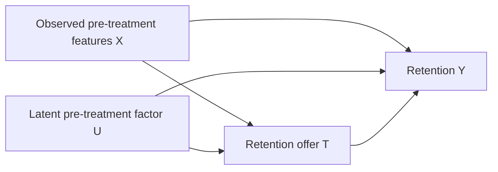

# Stage 8: Causal stress tests

Stage 8 probes two identification mechanisms: practical overlap and conditional
exchangeability given the observed covariates. It does not certify robustness to
all data-generating processes or establish performance on real customers.

## Prespecified design

Five independent seed cohorts (42–46), with 20,000 customers each, are reused
across six paired scenarios. Each scenario refits S/T/DR, with fixed algorithm
seed 42, 14,000 training customers, 3,000 calibration customers, and 3,000 final
evaluation customers. Financial assumptions remain $80 retention value, $10
cost, and at most 20% treatment capacity. There are 30 scenario/seed experiments,
90 learner fits, and 180 policy/scenario/seed results.

| Scenario | Assignment sharpness | Latent logit shift |
|---|---:|---:|
| Baseline | 1.0 | 0.0 |
| Moderate overlap | 2.5 | 0.0 |
| Severe overlap | 5.0 | 0.0 |
| Moderate hidden | 1.0 | 0.8 |
| Severe hidden | 1.0 | 1.6 |
| Combined severe | 5.0 | 1.6 |

Within each seed, covariates, customer IDs, splits, latent states, and assignment/
outcome uniform noise are paired across scenarios. Models and policies are
refitted/recalibrated independently under each scenario. Comparisons aggregate
seed cohorts, not dependent scenario rows or individual customers.

The baseline simulator is unchanged. Default stress settings reproduce its
original observed data and response surfaces exactly; this is tested. The stress
wrapper recovers uniform draws consistent with the baseline treatment/outcome
observations, then reuses those draws for the interventions. This is a common
random-number coupling, not use of simulator truth in model fitting.

## Poor-overlap intervention

Let `e0(X)` be the baseline propensity and `a0(X)=logit(e0(X))`. Assignment
sharpness `s` transforms its logit as:

`a_s(X) = mean(a0) + s * (a0(X) - mean(a0))`.

This preserves the logit center but does not preserve the treatment rate.
Propensities are bounded to [0.001, 0.999]. Moderate/severe sharpness pushes
customers toward very low or very high assignment probabilities. Response
surfaces are unchanged when the hidden shift is zero, so these comparisons
isolate assignment changes with common covariates and causal effects.

Strict positivity still holds by construction. The stress is weak *practical*
overlap and finite-sample support, rather than deterministic assignment or a
formal zero-probability positivity violation. Report true and estimated weak-
overlap fractions outside [0.05,0.95], propensity RMSE, clipped inverse-weight
extremes, and effective sample size.

## Hidden common cause and correctly defined CATE truth

Draw independent pre-treatment `U ~ Bernoulli(0.5)` and represent its states as
`-1` and `+1`. With hidden shift `h`, the assignment and both retention logits
receive the common shift `h * U_signed`:

- `e_u(X) = clip(sigmoid(a_s(X) + h*u), 0.001, 0.999)`;
- `mu_t,u(X) = sigmoid(logit(mu_t,baseline(X)) + h*u)`.

Treatment is sampled from the latent propensity and observed retention from the
latent response surface under that treatment. U influences both treatment and
retention and is excluded from the observed adjustment set. This violates
exchangeability given X when `h > 0`. Increasing `h` also changes causal
retention probabilities and true effects; between-scenario prediction errors are
not a pure decomposition of identification bias.

Learners use only X, so their causal target remains:

`mu_t(X) = 0.5 * mu_t,-1(X) + 0.5 * mu_t,+1(X)`;

`tau(X) = mu_1(X) - mu_0(X)`.

Oracle columns marginalize U instead of comparing X-only predictions with a
latent-U-specific effect. The oracle policy ranks that X-conditional effect and
is an upper bound among X-based policies. It does not target customers using U.
The baseline feature whitelist excludes all latent and oracle columns. Tests
verify the simulator and experiment interfaces obey that exclusion.

### Stress-test causal graph



U is excluded from the model adjustment set. Observed X can block the measured
backdoor path but cannot block `T <- U -> Y`. The baseline sets U's effect to
zero; hidden-confounding scenarios activate both outgoing U paths.

## Analytic identification-gap diagnostic

Treatment selects on U, so observational nuisance outcome functions differ from
causal response surfaces:

`m1_obs(X) = sum_u e_u(X)*mu_1,u(X) / sum_u e_u(X)`;

`m0_obs(X) = sum_u (1-e_u(X))*mu_0,u(X) / sum_u (1-e_u(X))`.

The observed propensity is the marginal `e(X) = mean_u(e_u(X))`. Even perfect
models of this propensity and these observed outcomes recover the confounded
contrast `m1_obs-m0_obs` when hidden confounding is present. The simulator can
calculate the exact conditional and average identification gap relative to
`tau(X)`.

An additional reference AIPW diagnostic plugs in these known observational
nuisance functions and clips at 0.001, within the simulator's propensity bounds.
These functions are used only for diagnosis, never fitting or policy decisions.
Reference AIPW may still have large finite-sample variance under weak overlap.
The analytic gap distinguishes identification failure from sampling noise.

Tests enumerate a complete joint P(U,T,Y) distribution. With perfect observed
nuisance functions, AIPW recovers an observational effect of 0.56 while the true
causal effect is 0.20. Cross-fitting and double robustness do not repair an
unmeasured common cause.

For each policy, save the analytic association-based profit and its gap from
true causal profit. These are simulation-only diagnostic quantities, not tools
available without additional assumptions in real observational data.

## Policy evaluation and stabilization diagnostics

Calibrate positive incremental-value thresholds on separate calibration
covariates and enforce the 20% cap on final evaluation covariates. No treatment,
retention, latent U, or oracle effect is used in choosing those thresholds.
Evaluate treat-none, random, S/T/DR, and the X-based oracle with causal response
surfaces. Save expected profit, regret, and oracle-profit fraction.

Fitted observational AIPW uses the DR learner's training-only nuisance models.
Its pointwise normal intervals remain illustrative and inherit Stage 6's
limitations: nuisance/calibration fitting uncertainty is omitted, and strict
cohort allocation can introduce dependence. This stage does not claim nominal
coverage or infer a causal effect from a favorable estimated profit.

Evaluation-only clipping sensitivity tests 0.01, 0.05, and 0.10, without
retraining models or changing decisions. It stabilizes inverse weights while
potentially changing bias; it does not restore exchangeability.

A separate diagnostic trims evaluation rows to estimated propensities inside
[0.05,0.95] and records subset size, subset true ATE, and subset fitted AIPW ATE.
Trimming changes the target population. The full-population and subset causal
ATEs are shown separately; a smaller subset error would not imply recovery of
the full-population effect. Policies are not reoptimized on this diagnostic
subset and trimming is not proposed as a hidden-confounding cure.

## Reproduction, provenance, and artifacts

```powershell
.venv\Scripts\python.exe scripts/run_stage8.py
.venv\Scripts\python.exe -m pytest -q
```

- Simulation: `src/stress_simulation.py`
- Experiment engine: `src/causal_stress.py`
- Runner: `scripts/run_stage8.py`
- Analysis: `notebooks/06_causal_stress_tests.ipynb`
- Tests: `tests/test_stress_simulation.py`, `tests/test_causal_stress.py`
- Published results: ten CSV files and a JSON manifest in `reports/tables/`
- Figures: six PNGs under `reports/figures/stage8_*.png`

The manifest records seeds, interventions, population size, economics, versions,
source hashes, row counts, and completion time. Atomic per-scenario checkpoints
under ignored `reports/stage8_cache/` are reused only for the same source,
configuration, and environment fingerprint. Checkpoints are not published.

The notebook renders saved tables and does not refit expensive models. Start
Jupyter from the repository/notebooks directory, or set `CAUSAL_INFERENCE_ROOT`
when using another working directory. The runner sets the kernel working
directory and persists successfully executed outputs and figure files.

For a local smoke run, use `--seeds 42 43 --population-size 1000`. This overwrites
published tables/notebook with the smaller configuration; rerun the default
command to restore the five-seed report. `--skip-notebook` computes tables only.

## Validation and limitations

All 72 tests pass, including baseline equivalence, unchanged response surfaces
under overlap stress, latent selection and causal/observational differences,
probability bounds, deterministic scenario coupling, invalid inputs, exact
identification failure with perfect nuisances, paired baseline matching, and
training/prediction feature whitelists.

Notebook completion checks require every seed/scenario/model/policy, unique
rows, finite key metrics, capacity feasibility, oracle dominance, exact zero
identification gaps without hidden U, positive analytic hidden-confounding gaps,
increased weak overlap under severe assignment stress, matching paired deltas,
manifest row counts, and six saved figures. No assertion requires one learner
to dominate or prediction error to worsen monotonically.

Five seeds support an initial controlled stress study, not reliable tail
coverage or universal robustness. Financial assumptions stay fixed, learner
configurations differ, and hidden U is a deliberately simple binary mechanism.
The study does not cover arbitrary hidden confounders, longitudinal interference,
measurement error, real-data validation, or deterministic positivity failure.
Stage 9 remains final synthesis, report, README, and reproducible delivery.

## Published findings

The full five-seed report completed successfully. Severe overlap gives a 44.3%
mean weak-overlap fraction. Severe hidden confounding gives true ATE 0.1151,
analytic observational-minus-causal gap 0.3105, and fitted AIPW ATE 0.4271.
DR true oracle-profit capture falls from 80.4% at baseline to 59.2% with severe
hidden confounding. Learner rankings and errors need not deteriorate monotonically.
All 72 tests and notebook checks pass; all six figures were visually inspected.
Complete results and artifact links are in Section 17 of
[causal_design.md](causal_design.md).
